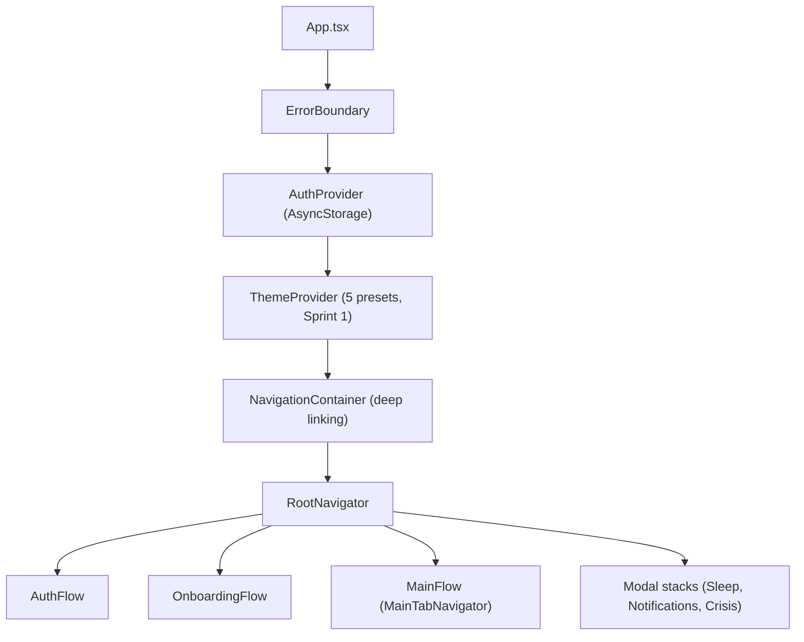

# Solace AI Mobile — Project Guide

**Status:** Migrating to prototype v4.2 design (cosmic editorial). See [docs/superpowers/plans/](./docs/superpowers/plans/) for the active roadmap.
**Last updated:** 2026-04-22

> This document describes the **current** state of the repository. For historical design direction and the target end state, read [`prototypes/README.md`](./prototypes/README.md) and [`DESIGN.md`](./DESIGN.md).

---

## What this repo is

A React Native mental wellness app (iOS, Android, Web-later) built with Expo. This branch is a **UI-first implementation** — navigation contracts and design system are mature; backend/domain integration is in progress.

**Product pillars:** Mood tracking · AI therapy chat · Journaling · Mindfulness · Assessments · Crisis support.

---

## Tech Stack (verified)

| Layer | Choice | Version |
|---|---|---|
| Runtime | Expo SDK | `^54.0.33` |
| React Native | | `0.81.5` |
| React / React DOM | | `19.1.0` |
| Language | TypeScript (`strict: true`) | `^5.3.3` |
| Navigation | React Navigation | `v6` (native, native-stack, bottom-tabs) |
| Animations | `react-native-reanimated` + `react-native-worklets` | `~4.1.1` / `^0.7.2` |
| State | **React Context + AsyncStorage** — no Redux | — |
| Storage | `@react-native-async-storage/async-storage`, `expo-sqlite` (installed, wired Sprint 8), `expo-secure-store` | — |
| Auth | AsyncStorage-only today → **Supabase** in Sprint 8 | — |
| Tests | Jest + `jest-expo` + `@testing-library/react-native` | — |
| E2E | Playwright (web target) | `^1.54.1` |
| Lint | ESLint + `eslint-plugin-react-native-a11y` (errors), Prettier | — |

**Not used (despite older docs that may reference them):** Redux, Redux Toolkit, Redux Persist, Moment.js, Crypto-JS (as a runtime dep), React Native Paper, a `theme-preview/` workspace, an `AppProvider.js` / `RefactoredAppProvider.js`.

---

## Runtime Architecture



Flow gating is driven by two persisted flags in `AuthContext`:
- `isAuthenticated`
- `hasCompletedOnboarding`

See [`src/app/AuthContext.tsx`](./src/app/AuthContext.tsx) and [`src/app/navigation/RootNavigator.tsx`](./src/app/navigation/RootNavigator.tsx).

---

## Source Layout

```
src/
├── app/                              # root: AuthContext, navigation shell
│   ├── AuthContext.tsx
│   └── navigation/                   # RootNavigator, MainTabNavigator, stacks/*, linking.ts
├── features/<domain>/                # domain modules — screens, components, hooks, services
│   ├── assessment/
│   ├── auth/
│   ├── chat/
│   ├── dashboard/
│   ├── errors/
│   ├── journal/
│   ├── mindful/
│   ├── mood/
│   ├── notifications/
│   ├── onboarding/
│   ├── profile/
│   ├── search/
│   └── sleep/
└── shared/                           # cross-cutting
    ├── components/
    │   ├── atoms/                    # Button, Input, Badge, AppIcon, ...
    │   ├── molecules/                # Card, SearchBar, BottomSheet, ...
    │   ├── organisms/                # ChatBubble, MoodCalendar, ScoreCard, ...
    │   └── primitives/               # cosmic primitives (BreathingOrb, MoodFace, etc. — Sprint 1+2)
    ├── data/                         # SQLite + repositories (Sprint 8)
    ├── hooks/                        # useHaptic, useReducedMotion, ...
    ├── services/                     # audio, notifications (Sprint 8+)
    ├── theme/                        # tokens, ThemeProvider (presets from Sprint 1)
    ├── types/                        # global types (navigation contracts)
    └── utils/                        # pure helpers
```

### Import aliases (`tsconfig.json`)

```
@/*            → src/*
@app/*         → src/app/*
@features/*    → src/features/*
@shared/*      → src/shared/*
@components/*  → src/shared/components/*
@theme/*       → src/shared/theme/*
@utils/*       → src/shared/utils/*
```

---

## Navigation topology

**Tabs (MainTabNavigator):** Dashboard · Mood · Chat · Journal · Profile.
**Root-mounted modals:** Sleep, Notifications, Crisis (Sprint 9). Stress + Community + Resources are being removed in Sprint 3.
**Deep link scheme:** `solace://` + universal links at `https://solace-ai.app` / `https://*.solace-ai.app`.

See [`src/shared/types/navigation.ts`](./src/shared/types/navigation.ts) for the strict per-stack `ParamList` types and [`src/app/navigation/linking.ts`](./src/app/navigation/linking.ts) for the deep-link map.

---

## Quick Start

```bash
# Prerequisites: Node 18+, npm, Xcode (iOS), Android Studio (Android)
npm install --legacy-peer-deps
cp .env.example .env          # fill in Supabase URL + anon key when Sprint 8 lands
npm start                      # Expo dev server — then press `i` / `a` / `w`
```

### Common commands

```bash
npm start                        # Expo dev server
npm run android                  # build + run Android
npm run ios                      # build + run iOS
npm run web                      # Expo Web

npm test                         # Jest in watch mode
npm run test:ci                  # CI — Jest with coverage
npm run test:playwright          # Playwright E2E (web)
npm run lint                     # ESLint
npm run lint:fix                 # ESLint autofix

npx tsc --noEmit                 # type-check (currently not zero-errors; migration goal is monotonic decrease)
```

---

## Current migration: prototype v4.2

The repo is mid-migration. Sources of truth for the target state:

- [`prototypes/README.md`](./prototypes/README.md) — cosmic editorial architecture (one-file-per-screen, 5 themes, motion primitives)
- [`prototypes/SCREENS.md`](./prototypes/SCREENS.md) — 42-screen catalog with design intent
- [`prototypes/RN-SPECS.md`](./prototypes/RN-SPECS.md) — React Native specs for the 8 priority screens
- [`prototypes/SUGGESTIONS.md`](./prototypes/SUGGESTIONS.md) — design rationale

Active plan: [`docs/superpowers/plans/2026-04-22-sprint-plan.md`](./docs/superpowers/plans/2026-04-22-sprint-plan.md) — 11 sprints, task-level detail in the companion migration plan.
Execution rules + design system: [`DESIGN.md`](./DESIGN.md).

### What the migration changes
- Palette: legacy brown/tan/olive/gold → cosmic midnight/aurora/sage/peach/lavender/warm/mist.
- Typography: system sans → Fraunces (serif display) + Inter (body) + Fira Code (mono).
- Themes: single static → 5 runtime-switchable presets (Cosmic Night default).
- Accessibility: WCAG AA → AAA target (contrast audit in CI).
- Screen count: ~150 fragmented screens → 42 prototype-aligned.
- Auth: AsyncStorage mock → Supabase (Sprint 8).
- Persistence: none (prop-driven) → SQLite with sync-ready columns (Sprint 8).
- Chat: UI-only placeholder → fully working via `mockChatService` (Sprint 2), LLM backend deferred.
- Crisis: new first-class feature module (Sprint 9), rule-based keyword tripwire.

---

## Safety notice

This app surfaces mental health content but is **not a substitute for emergency medical care**. If a user is in immediate danger, the in-app Crisis Support flow directs them to 988 (US) / HOME text line / international resources.

---

## Contribution gate

Before pushing:
```bash
npm run lint
npm run test:ci
npx tsc --noEmit   # count must not increase vs baseline (see docs/superpowers/plans/baseline-metrics.txt)
```

Every new screen must meet the per-screen Definition of Done in [`DESIGN.md`](./DESIGN.md) § 17.

---

## License

No explicit license file in this branch. Add one before open-sourcing.
