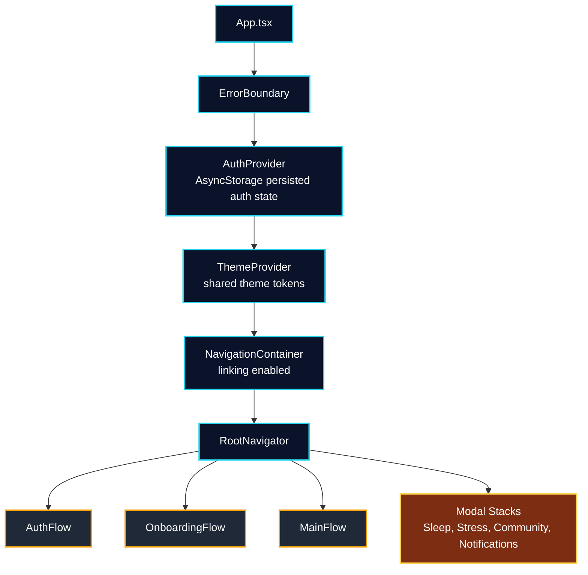
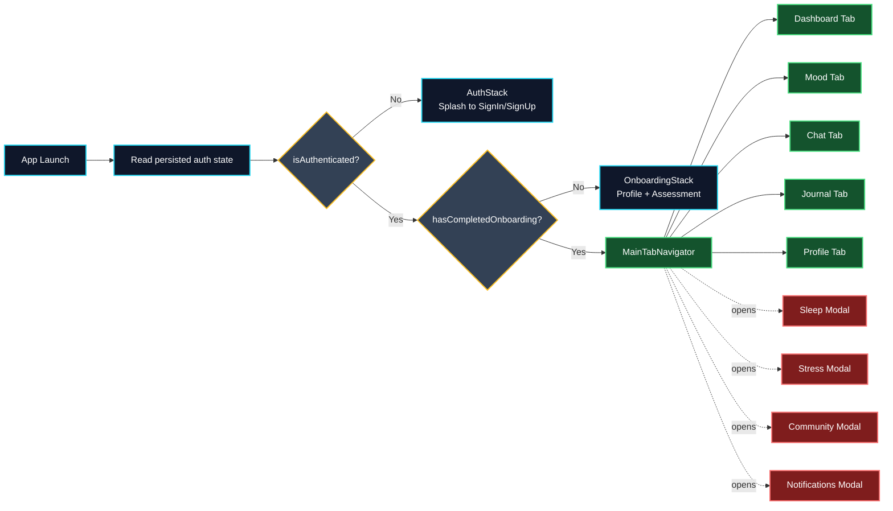

# 🧠 Solace AI Mobile - Project Guide

**Version**: 1.0.0 | **Status**: Production-Ready | **Last Updated**: October 2025

---

## 📋 Table of Contents

1. [Overview](#overview)
2. [Quick Start](#quick-start)
3. [Project Structure](#project-structure)
4. [Architecture](#architecture)
5. [Development](#development)
6. [Testing](#testing)
7. [Deployment](#deployment)
8. [Features](#features)
9. [Technologies](#technologies)
10. [Contributing](#contributing)

---

## 🎯 Overview

**Solace AI Mobile** is a comprehensive React Native mental health application that provides:

- 🤖 **AI Therapy Chat** - Empathetic conversational support powered by AI
- 📊 **Mood Tracking** - Detailed mood analytics and trends
- 🧘 **Mindfulness** - Guided meditation and breathing exercises
- 📝 **Journaling** - Secure mental health journaling with mood tagging
- 🆘 **Crisis Support** - Emergency intervention features and resources
- 👥 **Community** - Peer support groups and community features
- 📈 **Assessments** - Comprehensive mental health assessments
- 🌓 **Dark/Light Themes** - Therapeutic color palettes optimized for mental wellness
- ♿ **Accessibility** - Full screen reader support and reduced motion options

**Target Users**: Individuals seeking mental health support, users with anxiety/depression, wellness enthusiasts

**Platform Support**: iOS, Android, Web

---

## 🚀 Quick Start

### Prerequisites

- **Node.js** v16+ and npm v8+
- **Expo CLI** v6+
- **Git**
- **Xcode** (macOS, for iOS development)
- **Android Studio** (for Android development)

### Installation

```bash
# Clone repository
git clone https://github.com/Rayyan9477/Solace-AI-Mobile.git
cd Solace-AI-Mobile

# Install dependencies
npm run setup

# For main app only
npm install

# For Expo modules (if needed)
npm run expo:install
```

### Running the Application

```bash
# Start Expo development server
npm start

# Then press:
# 'a' for Android emulator
# 'i' for iOS simulator
# 'w' for web browser

# Alternative: Start both main app and theme preview
npm run dev

# Web-only development
npm run web
```

### Building for Production

```bash
# Android build
npm run android

# iOS build
npm run ios

# Web build
npm run theme-preview:build
```

---

## 📁 Project Structure

### Root Level Organization

```
Solace-AI-Mobile/
├── src/                          # Source code (primary focus)
├── test/                         # Test files
├── ui-designs/                   # UI design files and references
├── theme-preview/                # Theme preview application
├── coverage/                     # Test coverage reports (gitignored)
│
├── ARCHITECTURE.md               # Detailed architecture documentation
├── CLAUDE.md                     # AI development guidelines
├── PROJECT.md                    # This file
├── CONTRIBUTING.md               # Contribution guidelines
├── DESIGN_GUIDE.md              # Design system documentation
├── README.md                     # Project README
│
├── App.js                        # Entry point
├── app.json                      # Expo configuration
├── babel.config.js              # Babel configuration with import aliases
├── jest.config.js               # Jest test configuration
├── jest.setup.js                # Jest setup file
├── metro.config.js              # Metro bundler configuration
├── playwright.config.js         # Playwright E2E configuration
├── tsconfig.json                # TypeScript configuration
│
├── package.json                 # Dependencies and scripts
├── package-lock.json            # Dependency lock file
└── .env.example                 # Environment variables template
```

### Source Code Structure (`src/`)

```
src/
├── app/                          # App-level configuration
│   ├── navigation/
│   │   └── AppNavigator.js      # Main navigation routing
│   ├── providers/
│   │   ├── AppProvider.js       # Redux, theme, contexts
│   │   └── RefactoredAppProvider.js  # Main orchestrator
│   ├── services/
│   │   ├── apiService.js        # API communication
│   │   └── authService.js       # Authentication logic
│   └── store/
│       ├── store.js             # Redux configuration
│       └── slices/              # Feature state slices
│           ├── authSlice.js
│           ├── moodSlice.js
│           ├── chatSlice.js
│           ├── assessmentSlice.js
│           └── therapySlice.js
│
├── features/                     # Feature modules (domain logic)
│   ├── auth/                    # Authentication
│   │   ├── screens/             # Auth screens
│   │   └── services/            # Auth-specific logic
│   ├── mood/                    # Mood tracking (consolidated)
│   │   ├── screens/             # MoodTrackerScreen, MoodStatsScreen, etc.
│   │   ├── components/          # Mood-specific components
│   │   └── index.ts
│   ├── chat/                    # AI therapy chatbot
│   │   ├── screens/
│   │   ├── components/          # ChatBubble, MessageInput, etc.
│   │   └── services/
│   ├── assessment/              # Mental health assessments
│   │   ├── screens/
│   │   ├── components/
│   │   └── services/
│   ├── crisis/                  # Crisis intervention
│   │   ├── screens/
│   │   └── components/
│   ├── wellness/                # Mindfulness and wellness
│   ├── profile/                 # User profile management
│   ├── dashboard/               # Main dashboard
│   │   ├── screens/
│   │   ├── components/          # MoodCheckIn, QuickActions, etc.
│   │   └── index.ts
│   ├── onboarding/              # User onboarding flow
│   └── notifications/           # Smart notifications
│
├── shared/                       # Shared across all features
│   ├── components/              # Reusable UI components (Atomic Design)
│   │   ├── atoms/               # Basic components (Button, Input, etc.)
│   │   ├── molecules/           # Component combinations (Card, Modal, etc.)
│   │   ├── organisms/           # Complex components (Layout, Nav Bar)
│   │   └── icons/               # Icon system
│   ├── hooks/                   # Custom React hooks
│   ├── utils/                   # Utility functions
│   ├── services/                # Shared services
│   │   ├── apiService.js
│   │   ├── storageService.js
│   │   └── notificationService.js
│   ├── config/                  # App configuration constants
│   ├── constants/               # App-wide constants
│   ├── theme/                   # Theme system
│   │   ├── UnifiedThemeProvider.js
│   │   ├── lightTheme.js
│   │   └── darkTheme.js
│   ├── types/                   # TypeScript types/interfaces
│   └── assets/                  # Images, fonts, media
```

### Test Structure (`test/`)

```
test/
├── app/                         # App-level tests
├── components/                  # Component tests
├── contexts/                    # Context tests
├── features/                    # Feature-specific tests
├── integration/                 # Integration tests
├── navigation/                  # Navigation tests
├── performance/                 # Performance tests
├── shared/                      # Shared component tests
└── utils/                       # Utility function tests
```

---

## 🏗️ Architecture

### Design Principles

1. **Feature-Based Architecture** - Code organized by features, not technical layers
2. **Atomic Design Pattern** - Components categorized as atoms, molecules, organisms
3. **Single Responsibility** - Each module has one clear purpose
4. **Separation of Concerns** - Features own their screens and components
5. **Reusability** - Shared components in `shared/` directory

### Runtime Composition (Current)

The current runtime app wiring is context-driven for auth/session state and stack-driven for navigation.



### Navigation Structure

React Navigation v6 with stack and tab navigation:



### Theme System

**UnifiedThemeProvider** handles all theming:

- **Light Theme**: Clean, energizing colors for active hours
- **Dark Theme**: Therapeutic brown palette for relaxation
- **Therapeutic Colors**: Specifically chosen for mental wellness
- **Accessibility**: High contrast modes and reduced motion support

Theme properties:
```javascript
{
  mode: 'light' | 'dark',
  colors: { primary, secondary, background, text, ... },
  spacing: { small, medium, large, ... },
  typography: { heading, body, caption, ... },
  utilities: { elevation, borderRadius, opacity, ... }
}
```

### Import Aliases

**Configured in `babel.config.js`** for cleaner imports:

```javascript
'@app/*'        → 'src/app/*'           // App configuration
'@features/*'   → 'src/features/*'      // Feature modules
'@shared/*'     → 'src/shared/*'        // Shared components
'@components/*' → 'src/shared/components/*'  // UI components
'@theme/*'      → 'src/shared/theme/*'  // Theme system
'@utils/*'      → 'src/shared/utils/*'  // Utilities
```

**Usage:**
```javascript
// ✅ Good
import { Button } from '@components/atoms/Button';
import { useTheme } from '@theme/ThemeProvider';
import { formatDate } from '@utils/dateUtils';

// ❌ Avoid
import { Button } from '../../../shared/components/atoms/Button';
```

### Diagram Tooling (Mermaid)

For local rendering/export and docs quality checks:

```bash
npm install -D @mermaid-js/mermaid-cli markdownlint-cli prettier
```

```bash
npx mmdc -i docs/diagrams/navigation-flow.mmd -o docs/diagrams/navigation-flow.svg
npx markdownlint "**/*.md"
```

---

## 💻 Development

### Development Commands

#### Running & Building

```bash
# Development server
npm start                    # Start Expo CLI
npm run web                  # Web development

# Platform-specific builds
npm run android              # Android development
npm run ios                  # iOS development

# Concurrent development (main app + theme preview)
npm run dev
```

#### Code Quality

```bash
# Linting
npm run lint                 # Check for linting issues
npm run lint:fix             # Auto-fix linting issues

# Formatting
npx prettier --write .       # Format code (configured in package.json)
```

#### Development Workflow

```bash
# Setup once
npm run setup                # Install all dependencies

# Daily development
npm run dev                  # Run main app + theme preview concurrently

# Troubleshooting
npm run expo:install         # Install Expo modules for native features
```

### Code Standards

**See [CONTRIBUTING.md](./CONTRIBUTING.md) for detailed guidelines**

#### Style Guide

- **Functional Components**: Use React Hooks, no class components
- **Naming**: camelCase for variables/functions, PascalCase for components
- **Props**: Use TypeScript interfaces or PropTypes
- **Imports**: Use absolute imports with aliases
- **File Organization**: One component per file, related exports in index.js

#### Example Component Structure

```javascript
import React, { useState } from 'react';
import { View, Text, TouchableOpacity } from 'react-native';
import { useTheme } from '@theme/ThemeProvider';
import styles from './Button.styles';

/**
 * TherapeuticButton - Accessible button component
 * @component
 * @param {Object} props
 * @param {string} props.label - Button text
 * @param {Function} props.onPress - Press handler
 * @param {string} props.variant - 'primary' | 'secondary' | 'danger'
 * @param {boolean} props.disabled - Disabled state
 */
export const TherapeuticButton = ({
  label,
  onPress,
  variant = 'primary',
  disabled = false,
}) => {
  const theme = useTheme();
  
  return (
    <TouchableOpacity
      style={[
        styles.button,
        { backgroundColor: theme.colors[variant] }
      ]}
      onPress={onPress}
      disabled={disabled}
      accessible
      accessibilityLabel={label}
      accessibilityRole="button"
    >
      <Text style={styles.label}>{label}</Text>
    </TouchableOpacity>
  );
};

export default TherapeuticButton;
```

---

## 🧪 Testing

### Test Coverage

- **Unit Tests**: Jest for components, hooks, utilities
- **Integration Tests**: Feature workflows and user journeys
- **Accessibility Tests**: Screen reader simulation and keyboard navigation
- **E2E Tests**: Playwright for critical user paths
- **Performance Tests**: Animation and rendering performance

### Running Tests

```bash
# All tests
npm test                     # Jest watch mode
npm run test:ci              # CI mode with coverage

# Specific test suites
npm run test -- --testPathPattern=Navigation  # Run specific test
npm run test:coverage        # Generate coverage report
npm run test:update          # Update snapshots

# E2E tests (Playwright)
npm run test:playwright      # Run all E2E tests
npm run test:playwright:headed  # With browser visible
npm run test:playwright:debug   # Debug mode
npm run test:playwright:mobile  # Test on mobile devices
npm run test:playwright:report  # View HTML report

# Accessibility tests
npm run test -- --testPathPattern=accessibility
```

### Writing Tests

**Example Unit Test:**
```javascript
import { render, screen, fireEvent } from '@testing-library/react-native';
import { TherapeuticButton } from './TherapeuticButton';

describe('TherapeuticButton', () => {
  it('renders button with label', () => {
    render(<TherapeuticButton label="Press me" onPress={() => {}} />);
    expect(screen.getByText('Press me')).toBeTruthy();
  });

  it('calls onPress when pressed', () => {
    const onPress = jest.fn();
    const { getByRole } = render(
      <TherapeuticButton label="Click" onPress={onPress} />
    );
    fireEvent.press(getByRole('button'));
    expect(onPress).toHaveBeenCalled();
  });
});
```

---

## 🚢 Deployment

### Pre-Deployment Checklist

```bash
# 1. Run complete test suite
npm run test:ci

# 2. Check for linting issues
npm run lint

# 3. Build for target platform
npm run android  # or npm run ios

# 4. Test on actual device
# - Install on physical device/emulator
# - Test critical user journeys
# - Verify crisis support features work
# - Test theme switching

# 5. Check performance
# - Monitor memory usage
# - Test with slow network
# - Verify animations are smooth
```

### Build Configuration

**Android:**
- Minimum SDK: 21
- Target SDK: 34
- Bundle format: AAB for Google Play

**iOS:**
- Minimum deployment target: 13.0
- Device support: iPhone 8+
- Bundle format: IPA for App Store

**Web:**
- Bundle optimization enabled
- Tree-shaking for unused code
- Service worker for offline support (if configured)

### Environment Variables

Create `.env` file from `.env.example`:

```bash
# Copy example
cp .env.example .env

# Fill in values
REACT_APP_API_URL=https://api.example.com
REACT_APP_API_KEY=your_api_key
REACT_APP_ENVIRONMENT=production
REACT_APP_FIREBASE_CONFIG=...
```

---

## ✨ Features

### Core Features

#### 1. **Authentication**
- Email/password login and signup
- Social login (Google, Apple)
- Secure token management
- Automatic session recovery
- Password reset flow

#### 2. **Mood Tracking**
- 5+ mood options with custom intensity
- Daily mood history with trends
- Mood-based activity tracking
- Analytics dashboard
- Exportable reports

#### 3. **AI Therapy Chat**
- Natural language conversations
- Context-aware responses
- Mood-based suggestions
- Voice input/output
- Conversation history and export

#### 4. **Mindfulness & Wellness**
- Guided meditation sessions
- Breathing exercises (4-7-8, box breathing)
- Progressive relaxation techniques
- Sleep quality tracking
- Wellness resource library

#### 5. **Mental Health Journal**
- Secure journaling with mood tagging
- Rich text editor with formatting
- Calendar-based entry browsing
- Search and filter functionality
- Private note encryption

#### 6. **Assessments**
- Comprehensive mental health screening
- Evidence-based questionnaires
- Instant results and recommendations
- Historical tracking
- Professional resource referrals

#### 7. **Crisis Support**
- Emergency resource directory
- Crisis hotline integration
- Immediate support access
- Safety planning tools
- Emergency contact quick-dial

#### 8. **Community Support**
- Moderated support groups
- Peer-to-peer messaging
- Success story sharing
- Resource recommendations
- Community guidelines enforcement

#### 9. **Smart Notifications**
- Personalized mood check-ins
- Meditation reminders
- Milestone celebrations
- Health tips and insights
- Customizable frequency and timing

#### 10. **Accessibility**
- Full screen reader support (VoiceOver, TalkBack)
- Keyboard navigation
- High contrast mode
- Reduced motion support
- Adjustable text sizing

---

## 🛠️ Technologies

### Frontend Stack

| Technology | Version | Purpose |
|-----------|---------|---------|
| React Native | 0.76.9 | Mobile framework |
| Expo | ~52.0.0 | Development platform |
| React | 18.3.1 | UI library |
| Redux Toolkit | 2.2.7 | State management |
| React Navigation | 6.5.20 | Routing |
| React Native Paper | 5.14.5 | Material Design |
| Reanimated | 3.16.1 | Animations |
| React Native Gesture Handler | 2.20.0 | Gestures |
| TypeScript | 5.3.3 | Type safety |
| Jest | 29.7.0 | Testing framework |
| Playwright | 1.54.1 | E2E testing |
| Babel | 7.25.9 | JavaScript transpiler |

### Key Libraries

**State & Storage:**
- Redux Persist - Client-side state persistence
- Async Storage - Persistent key-value storage
- Expo SecureStore - Secure sensitive data storage

**Utilities:**
- Axios - HTTP client
- Crypto-JS - Encryption
- Moment.js - Date handling
- Lottie - Animation support

**UI & Theme:**
- Linear Gradient - Gradient backgrounds
- Vector Icons - Icon library
- SVG - Scalable graphics

**Media:**
- Expo AV - Audio and video
- Expo Image Picker - Image selection
- Expo Speech - Text-to-speech

---

## 👥 Contributing

See [CONTRIBUTING.md](./CONTRIBUTING.md) for detailed contribution guidelines.

### Quick Start for Contributors

1. **Fork and Clone**
   ```bash
   git clone https://github.com/YOUR_USERNAME/Solace-AI-Mobile.git
   ```

2. **Create Feature Branch**
   ```bash
   git checkout -b feature/description-of-feature
   ```

3. **Install Dependencies**
   ```bash
   npm run setup
   ```

4. **Make Changes**
   - Follow coding standards
   - Write tests for new features
   - Update documentation

5. **Test Before Commit**
   ```bash
   npm run lint:fix
   npm run test
   ```

6. **Push and Create Pull Request**
   ```bash
   git push origin feature/description-of-feature
   ```

---

## 📚 Additional Documentation

- **[ARCHITECTURE.md](./ARCHITECTURE.md)** - Deep dive into system design
- **[DESIGN_GUIDE.md](./DESIGN_GUIDE.md)** - Design system and UI guidelines
- **[CONTRIBUTING.md](./CONTRIBUTING.md)** - Developer contribution guide
- **[CLAUDE.md](./CLAUDE.md)** - AI development assistant guide

---

## 📞 Support & Resources

### Getting Help

- **Issue Tracker**: GitHub Issues
- **Documentation**: See README.md and project docs
- **Community**: Support groups in-app
- **Crisis Support**: In-app emergency resources

### Mental Health Resources

If you or someone you know is struggling:

- **National Suicide Prevention Lifeline**: 1-800-273-8255 (US)
- **Crisis Text Line**: Text HOME to 741741
- **International Association for Suicide Prevention**: https://www.iasp.info/resources/Crisis_Centres/

---

## 📄 License

Licensed under MIT License. See LICENSE file for details.

---

## 🙏 Acknowledgments

- Inspired by therapeutic best practices in digital mental health
- Built with ❤️ for mental wellness
- Special thanks to contributors and testers

---

**Last Updated**: October 2025 | **Maintained by**: Rayyan9477
