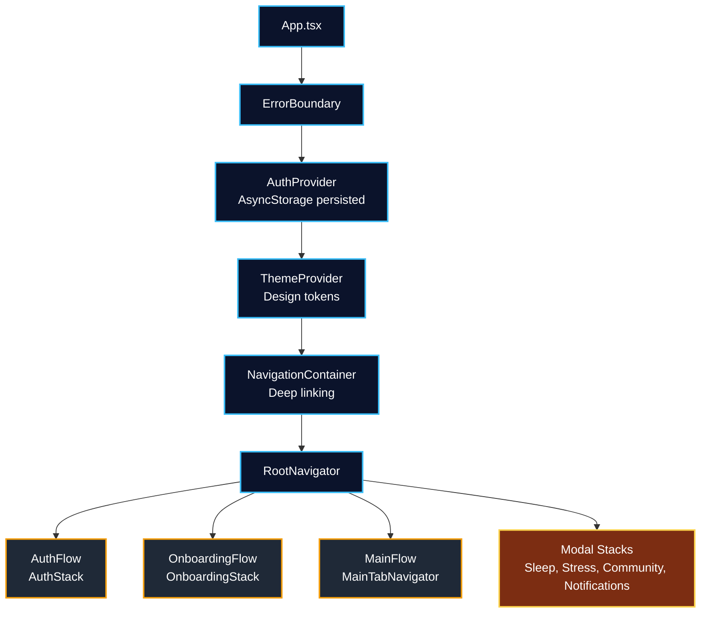
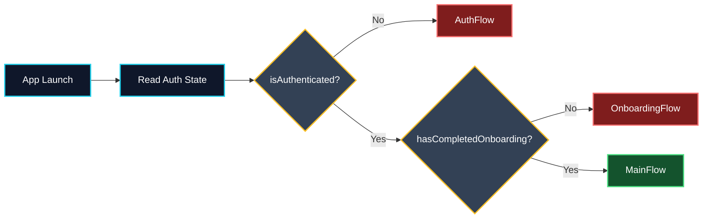

# Solace AI Mobile

A React Native mental wellness application built with Expo, TypeScript, and React Navigation.

The current repository is a UI-first implementation of a multi-flow mobile app that includes onboarding, assessment, mood tracking, journaling, chat UX, and profile/settings experiences.


## Project Snapshot

- Runtime stack: Expo SDK 54, React Native 0.81.5, React 19.1, TypeScript strict mode.
- Architecture style: Feature-first + shared design system tokens + typed navigation contracts.
- Auth/session: Context-based auth state persisted in AsyncStorage.
- Navigation: Root flow gating (auth, onboarding, main tabs) + modal feature stacks.
- Test footprint: 202 Jest test files under `src/` and Playwright E2E under `tests/`.
- Source footprint: 535 TypeScript/TSX files under `src/`.

## What This Repo Currently Is

This codebase is best understood as a high-fidelity frontend implementation with strong navigation/type contracts and extensive UI coverage.

- Many screens are wired with route adapters and placeholder/sample data.
- Core UX flows are implemented and test-covered.
- Backend/domain integration depth varies by feature and is still evolving.

## Tech Stack

### Core Runtime

- `expo` `^54.0.33`
- `react-native` `0.81.5`
- `react` `19.1.0`
- `react-dom` `19.1.0`
- `@react-navigation/native`, `@react-navigation/native-stack`, `@react-navigation/bottom-tabs`

### UX and Device Capabilities

- `react-native-reanimated` `~4.1.1`
- `react-native-worklets` `^0.7.2`
- `react-native-safe-area-context`, `react-native-screens`, `react-native-gesture-handler`
- Expo modules for camera, haptics, secure-store, sqlite, speech, updates, and more

### Quality Tooling

- Unit/integration: Jest + `jest-expo` + React Native Testing Library
- E2E: Playwright (`tests/comprehensive-app-test.spec.js`)
- Linting: ESLint (`universe/native`, `react-native`, `react-native-a11y`, Prettier plugin)
- Git hooks: Husky (configured via `prepare` script)

## Runtime Architecture (Verified)



### Flow Gating

Root routing is determined by two persisted flags:

- `isAuthenticated`
- `hasCompletedOnboarding`

Routing outcome:

- Not authenticated -> `AuthFlow`
- Authenticated but onboarding incomplete -> `OnboardingFlow`
- Authenticated and onboarding complete -> `MainFlow`

## Navigation Topology

### Main Tabs

- Dashboard
- Mood
- Chat
- Journal
- Profile

Each tab hosts a dedicated stack navigator. The root stack additionally exposes modal stacks:

- Sleep
- Stress
- Community
- Notifications

### Deep Linking

Configured in `src/app/navigation/linking.ts` with:

- Scheme: `solace://`
- Universal link prefixes:
  - `https://solace-ai.app`
  - `https://*.solace-ai.app`

Example links:

- `solace://auth/signin`
- `solace://mood/log`
- `solace://chat/abc123`
- `solace://journal/new`
- `solace://profile/notifications`

### Navigation Decision Flow



## Feature Domains in `src/features`

- `auth`
- `onboarding`
- `assessment`
- `dashboard`
- `mood`
- `chat`
- `journal`
- `profile`
- `notifications`
- `sleep`
- `stress`
- `community`
- `mindful`
- `resources`
- `search`
- `errors`

## Repository Structure

```text
.
├─ App.tsx
├─ app.json
├─ src/
│  ├─ app/                 # auth context + navigation root/stacks/linking
│  ├─ features/            # domain feature modules
│  └─ shared/              # design tokens, hooks, reusable components, types
├─ tests/                  # Playwright and test harness scripts
├─ docs/                   # implementation notes, audits, security/performance docs
├─ screenshots/            # visual regression/artifact captures
└─ ui-designs/             # design references
```

## Quick Start

### Prerequisites

- Node.js 18 LTS or newer (recommended for Expo SDK 54)
- npm
- Android Studio (Android) and/or Xcode (iOS, macOS only)

### Install

```bash
npm install --legacy-peer-deps
```

### Run

```bash
npm start
npm run android
npm run ios
npm run web
```

## Developer Commands

### App and Build

```bash
npm start
npm run prebuild
npm run android
npm run ios
npm run web
```

### Unit and Integration Testing

```bash
npm test
npm run test:watch
npm run test:coverage
npm run test:ci
```

### End-to-End Testing (Playwright)

```bash
npm run test:playwright
npm run test:playwright:headed
npm run test:playwright:debug
npm run test:playwright:desktop
npm run test:playwright:mobile
npm run test:playwright:report
```

Notes:

- Default Playwright project matrix is intentionally small (core projects only).
- Set `PLAYWRIGHT_FULL_MATRIX=1` to include the extended cross-device/browser matrix.
- `SOLACE_BASE_URL` can override the default test base URL (`http://localhost:8081`).

### Documentation Tooling (Optional)

Use these if you want local Mermaid exports and markdown quality checks.

```bash
npm install -D @mermaid-js/mermaid-cli markdownlint-cli prettier
```

```bash
npx mmdc -i docs/diagrams/architecture.mmd -o docs/diagrams/architecture.svg
npx markdownlint "**/*.md"
```

### Lint and Formatting

```bash
npm run lint
npm run lint:fix
```

## Implementation Contracts Worth Preserving

- Keep navigation params aligned with `src/shared/types/navigation.ts`.
- Use route adapters when a screen expects callback/data props rather than raw navigation props.
- Keep deep-link screen mappings in sync with mounted stack screens.
- Preserve token-first styling (`src/shared/theme/*`) instead of hard-coded values.

## Current Known Gaps

- `theme-preview` scripts reference a `theme-preview/` workspace that is not present in this branch.
- `parseDeepLink` in `src/app/navigation/linking.ts` is intentionally a TODO helper and currently returns `null`.
- Some routed screens still use placeholder data while domain logic is integrated incrementally.

## Documentation Index

- Project guide: `PROJECT.md`
- Architecture notes: `ARCHITECTURE.md`
- Implementation plan: `docs/implementation.md`
- Screen inventory: `SCREEN_INVENTORY.md`
- Security audit: `docs/security/SECURITY_AUDIT.md`
- Performance docs: `docs/performance/BUNDLE_ANALYSIS.md`
- UI audit reports: `docs/UI-AUDIT-VISUAL-REPORT.md`, `docs/UI_UX_DEEP_AUDIT_FINDINGS.md`

## Recommended Contribution Quality Gate

Before opening a PR:

```bash
npm run lint
npm run test:ci
npm run test:playwright
```

Also verify:

- no navigation contract drift,
- no broken deep links for changed screens,
- all new screens/components have tests,
- accessibility labels and roles are present for interactive elements.

## Safety Notice

This app may surface mental health content, but it is not a substitute for emergency medical care.

If a user is in immediate danger, direct them to local emergency services or a qualified crisis hotline in their region.

## License

No explicit license file is currently present in the repository root.

If this project is intended for open-source distribution, add a `LICENSE` file and a `license` field in `package.json`.
